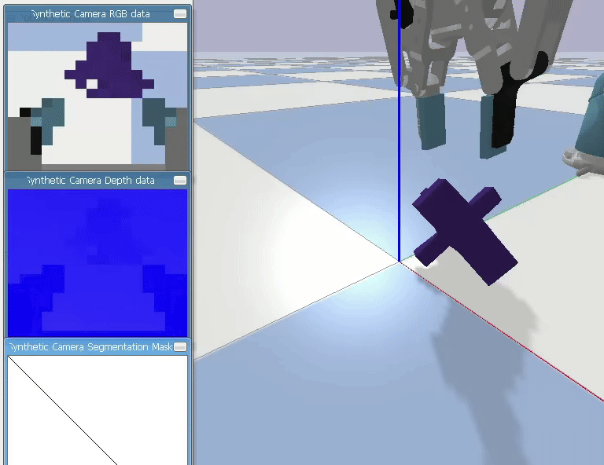
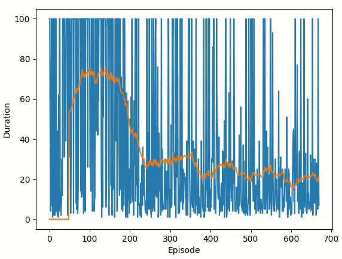

<h1> Robotic Grasping via Reinforcement Learning </h1>

2025-11-24 by David Nicklaser<br><br>

The project simulates robotic grasping in pybullet. The simulated robot is a UR5 arm in combination with the 2F-85 robotiq gripper and a depth camera mounted at the gripper. Reinforcement learning is done via DQN. <br><br>

One of the findings was that a low resolution of for example 16x16 is sufficient for computer vision based grasping. This indicates that sim-2-real is not necessary in this case and a real robot might learn the policy directly. Deployment in the real world can be done by a 2 stage pipeline. In the first stage an object is detected via for example YOLO, then the gripper moves closer to that object. After moving closer, in stage two, the policy from this project is employed by the robot to grasp at an advantageous location of the object.<br><br>

<h2>Installation</h2>

Clone the project and move into the directory:
>git clone https://github.com/Z5cc/robograsp.git  
>cd robograsp

Make sure you have *Python 3.9* installed and activated. You can check with:
>python3 --version

Create a virtual environment, activate it and install the requirements:
>python3 -m venv .venv && source .venv/bin/activate  
pip install -r requirements

Run the *train.py* file for reinforcement learning. Run the *user_control.py* file for being able to manually control the robot for testing purposes:
>python3 train.py  
>python3 user_control.py

For parameters modify the *CONSTANTS.py* file.


<h2>Environment</h2>

**State Space**

  
For the state space tensors of the form CxHxW are employed.  
HxW represent the size of the depth image and is set to 16x16.  
C represents the stack of history of depth images and is set to 4. After each step a new observation, in the form of a new depth image of size HxW, is returned. Then the state is updated by this observation by shifting the stack by -1 and then inserting the observation at last position in the stack. The stack is initiated by copying the first observation C times.  

**Action Space**

  
For the action space 13 possible discrete actions are employed. They can be cathegorized into *grasp* and actions for *seek*.  
The first action, *grasp*, is about the gripper moving forward until something is hit, then the gripper is closed. If during the closing process, the gripper registered that it grips something, the gripper is lifted. Otherwise the gripper is reopened and retreated.  
The other twelve actions for *seek* are about moving the TCP of the gripper in all translational directions by increments of 15 mm and all rotational directions by increments of 0.05 rad. The movements are relative to the coordinate axis of the TCP, not the axis of the world.

**Rewards**

=\begin{cases}100,&\text{if&space;object.z>threshold}\\0,&\text{else}\end{cases}$$)  
For the reward function a threshold is set. If during a step the object reaches that threshold height, a reward of 100 is given. Otherwise a reward of 0 is given. In addition to that, other reward functions involving distance and offset calculations have been tried. However they did not mark any improvements. Also when incorporating potential based reward shaping according to *Andrew Y. Ng*, no improvement could be determined  for these new reward functions.


<h2>Algorithm</h2>

For the algorithm DQN is employed due to its simplicity. The neural network for the policy and target network consists mainly of convolutional layers, because of the following theoretical idea. The scheme of this idea is explained in the following: Kernels of the form high-low-high would detect far-close-far patterns in the image which would represent good places to grasp. The policy network which takes as a input a state $s \in \mathcal{S}$ and outputs an action $a \in \mathcal{A}$ is designed in the following way:  

>4x16x16 -> **conv(3)** -> 8x16x16 -> **pool(2)** -> 8x8x8 -> **conv(3)** -> 16x8x8 -> **conv(3)** -> 16x8x8 -> **Flatten** -> 1024 -> **FC** -> 13

<h2>Demo</h2>

The demo shows training at around episode 700. Also the RGB camera is displayed, only the depth camera is used.  






<h2>Credits</h2>

**This project includes code licensed as follows:**

https://github.com/ElectronicElephant/pybullet_ur5_robotiq  
Original code: Copyright (c) 2021 ElectronicElephant, released under the BSD 2-Clause License.  

https://github.com/pytorch/tutorials/blob/main/intermediate_source/reinforcement_q_learning.py  
Original code: Copyright (c) 2017-2022 Pytorch contributors, released under the BSD 3-Clause License.

**If you use my project and this code in any form, please cite the following:**  

```bibtex
@misc{nicklaser2025robograsp,
title={Robograsp: Robotic Grasping via Reinforcement Learning},
author={Nicklaser, David},
year={2025},
url={https://github.com/Z5cc/robograsp}
}
```
